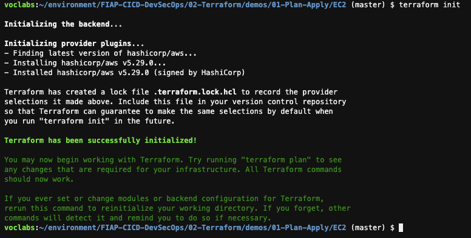
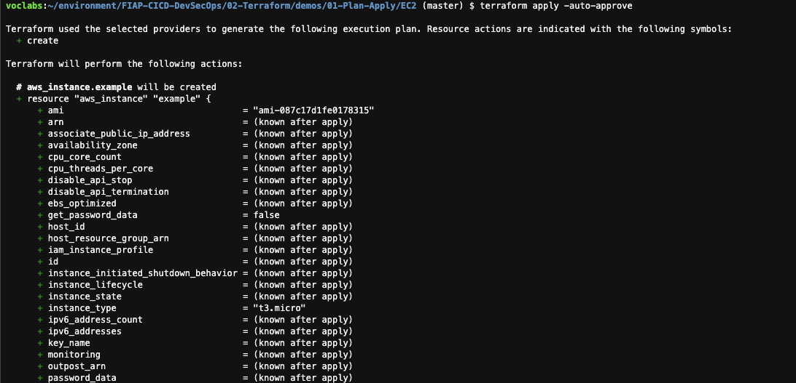
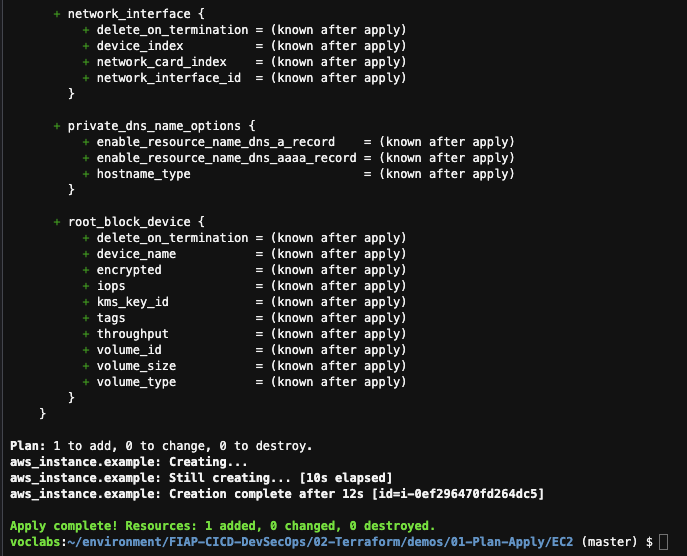
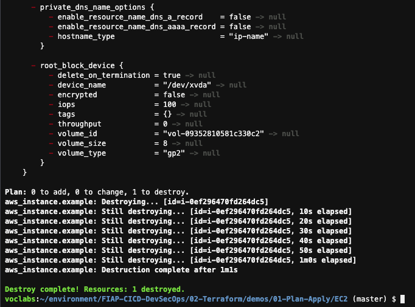
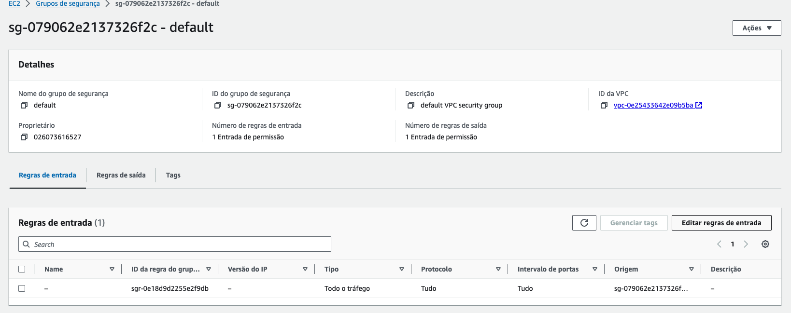

1. Execute o comando `cd ~/environment/impacta-devops-serverless/01-Devops/01-Terraform/demos/01-Plan-Apply/` para entrar na pasta do exercício.
2. Entre na pasta EC2 `cd EC2` para executar o primeiro exemplo que irá provisionar uma maquina EC2 na AWS.
3. Execute o comando `terraform init`

   

<details>
<summary> 
<b>Explicação terraform init </b>

</summary>

<blockquote>
O comando `terraform init` é o primeiro comando que deve ser executado ao iniciar um novo projeto com o Terraform, pois ele é responsável por inicializar o ambiente de trabalho. Este comando prepara o diretório de trabalho atual para o uso do Terraform configurando os plugins necessários para que o Terraform interaja com os provedores e armazenamentos remotos. Abaixo está uma explicação detalhada de cada aspecto do `terraform init`.

### Sintaxe Básica
```bash
terraform init [opções]
```

### O que `terraform init` Faz

1. **Baixa e Instala Plugins de Provedores**: 
   - O Terraform depende de provedores (como AWS, Azure, GCP) para interagir com os recursos de infraestrutura.
   - `terraform init` identifica os provedores especificados no código (arquivos `.tf`) e faz o download das versões adequadas dos plugins de provedores.

2. **Configura o Back-end de Estado**:
   - Se o projeto usa um backend remoto para armazenamento do estado (como S3, GCS, etc.), `terraform init` configura o backend de acordo com a configuração especificada.
   - O backend armazena o estado do projeto, permitindo colaboração entre múltiplos usuários e facilitando o controle de versão.

3. **Inicializa Módulos**:
   - Caso o projeto utilize módulos, `terraform init` faz o download dos módulos externos (por exemplo, de um repositório Git ou do Terraform Registry) e os coloca no diretório `.terraform/modules`.

4. **Atualização Condicional de Plugins**:
   - Quando `terraform init` é executado, ele verifica se os plugins já estão instalados. Se estiverem, ele não faz download novamente, a menos que uma nova versão seja especificada ou que a opção `-upgrade` seja usada.

### Opções Comuns

- **`-backend-config=<PATH>`**:
  - Permite especificar configurações personalizadas de backend usando um arquivo ou chave-valor.

- **`-get=true|false`**:
  - Define se os módulos devem ser buscados ou atualizados no momento da inicialização. Padrão é `true`.

- **`-upgrade`**:
  - Força o download das versões mais recentes dos plugins e módulos.

### Exemplo de Uso

```bash
terraform init -backend-config="backend.hcl"
```

Neste exemplo, o Terraform inicializa o backend usando as configurações especificadas no arquivo `backend.hcl`.

### Mensagens de Saída

Após a execução de `terraform init`, você verá mensagens indicando que:
- Plugins de provedores foram baixados e instalados.
- Módulos foram baixados e configurados.
- Backend foi configurado para armazenar o estado.

### Conclusão

O comando `terraform init` é essencial para preparar o ambiente do Terraform antes de realizar outras operações como `plan` ou `apply`. Ele garante que os recursos de infraestrutura possam ser provisionados com sucesso, configurando todos os componentes e dependências necessárias.

</blockquote>

</details>

4. Agora execute um `terraform plan` para confirmar o que será provisionado.

   


<details>
<summary> 
<b>Explicação terraform plan</b>

</summary>

<blockquote>

O comando `terraform plan` é usado para criar um plano de execução do Terraform, que mostra quais ações o Terraform realizará para atingir o estado desejado da infraestrutura. Ele não faz nenhuma alteração real, apenas gera um plano, permitindo que você visualize as mudanças antes de aplicá-las.

### Sintaxe Básica
```bash
terraform plan [opções]
```

### O que `terraform plan` Faz

1. **Analisa a Configuração e o Estado Atual**:
   - O Terraform compara o estado atual da infraestrutura (salvo no arquivo de estado ou no backend remoto) com a configuração especificada nos arquivos `.tf`.
   
2. **Gera um Plano de Execução**:
   - O plano mostra as operações que serão realizadas para alcançar o estado desejado, indicando quais recursos serão **criadas**, **atualizados** ou **destruídos**.

3. **Ajuda na Revisão e Prevenção de Erros**:
   - `terraform plan` permite que os usuários revisem as mudanças antes de aplicá-las, ajudando a prevenir alterações indesejadas ou erros.

### Exemplo de Saída do `terraform plan`

A saída típica do comando é uma lista de operações planejadas, com uma marcação que indica o tipo de operação:
- **"+"**: Recursos que serão criados.
- **"~"**: Recursos que serão modificados.
- **"-"**: Recursos que serão destruídos.

Exemplo:
```
+ aws_instance.example
      ami:                "ami-0c55b159cbfafe1f0"
      instance_type:      "t2.micro"
```

Nesse exemplo, o `+` indica que uma nova instância EC2 será criada com a configuração especificada.

### Opções Comuns

- **`-out=<caminho>`**:
  - Salva o plano gerado em um arquivo para ser usado posteriormente pelo comando `terraform apply`.
  
- **`-var 'nome_variavel=valor'`**:
  - Permite passar variáveis diretamente no comando. 

- **`-var-file=<caminho>`**:
  - Permite especificar um arquivo de variáveis, útil para armazenar configurações fora dos arquivos de código.

- **`-refresh=false`**:
  - Impede o Terraform de atualizar o estado antes de criar o plano (útil em algumas situações de desenvolvimento).

### Exemplo de Uso

```bash
terraform plan -out=plan.tfplan
```

Neste exemplo, o Terraform gera um plano de execução e o salva no arquivo `plan.tfplan`, que pode ser aplicado posteriormente com o comando `terraform apply plan.tfplan`.

### Uso em Conjunto com `terraform apply`

O `terraform plan` é geralmente seguido pelo `terraform apply` para aplicar o plano gerado. Quando você salva o plano com `-out`, pode aplicar o plano exato gerado com:

```bash
terraform apply plan.tfplan
```

### Conclusão

O `terraform plan` é uma etapa crítica no fluxo de trabalho do Terraform. Ele ajuda a revisar e verificar as mudanças que serão feitas na infraestrutura antes de aplicá-las, evitando alterações não intencionais e aumentando a segurança e previsibilidade das operações.

</blockquote>
</details>

5. Agora execute um `terraform apply -auto-approve` para que sejam criados os recursos na AWS.

    
    


<details>
<summary> 
<b>Explicação Código Terraform</b>

</summary>

<blockquote>
Aqui está uma explicação detalhada dos arquivos Terraform fornecidos, escrita para garantir clareza total sobre a execução do código.

---

### Arquivo `provider.tf`

Este arquivo configura o provedor AWS, necessário para que o Terraform gerencie recursos na Amazon Web Services.

```hcl
provider "aws" {
    region = "${var.AWS_REGION}"
}
```

#### Explicação
- **`provider "aws"`**: Define a AWS como o provedor, que é o serviço onde os recursos serão criados.
- **`region = "${var.AWS_REGION}"`**: A região onde os recursos da AWS serão criados. A variável `${var.AWS_REGION}` é referenciada para determinar a região, e o valor padrão será definido no arquivo `vars.tf`.

---

### Arquivo `vars.tf`

Este arquivo define variáveis que podem ser reutilizadas em outras configurações do Terraform.

```hcl
variable "AWS_REGION" {
  default = "us-east-1"
}
variable "AMIS" {
  type = map(string)
  default = {
    us-east-1 = "ami-087c17d1fe0178315"
    us-west-2 = "ami-06b94666"
    eu-west-1 = "ami-0d729a60"
  }
}
```

#### Explicação
- **`variable "AWS_REGION"`**: Define uma variável chamada `AWS_REGION` com valor padrão `"us-east-1"`, que especifica a região onde os recursos AWS serão criados.
- **`variable "AMIS"`**: Define um mapa de AMIs (Amazon Machine Images) por região. O `type = map(string)` define que essa variável é um mapa (chave-valor) de strings. Este mapa permite que o código escolha a AMI correta com base na região definida em `AWS_REGION`.

    - **AMIs por região**:
      - `"us-east-1"`: `"ami-087c17d1fe0178315"`
      - `"us-west-2"`: `"ami-06b94666"`
      - `"eu-west-1"`: `"ami-0d729a60"`
  
---

### Arquivo `instance.tf`

Este arquivo cria uma instância EC2 usando a AWS e configurações definidas anteriormente.

```hcl
resource "aws_instance" "example" {
  ami           = "${lookup(var.AMIS, var.AWS_REGION)}"
  instance_type = "t3.micro"
}
```

#### Explicação
- **`resource "aws_instance" "example"`**: Define um recurso de instância EC2 na AWS com o nome `example`.
- **`ami = "${lookup(var.AMIS, var.AWS_REGION)}"`**: Seleciona a AMI correta para a instância com base na região. A função `lookup(var.AMIS, var.AWS_REGION)` busca a AMI específica de acordo com o valor de `AWS_REGION`. Por exemplo, se `AWS_REGION` for `"us-east-1"`, a AMI utilizada será `"ami-087c17d1fe0178315"`.
- **`instance_type = "t3.micro"`**: Define o tipo da instância como `t3.micro`, uma escolha de instância pequena e econômica.

---

### Resumo do Comportamento

Este código cria uma instância EC2 na AWS na região especificada em `AWS_REGION` (padrão é `"us-east-1"`). Ele seleciona automaticamente a AMI correspondente para a região definida e usa o tipo de instância `t3.micro`.

1. **Provedor AWS**: Configura a região onde os recursos serão criados.
2. **Variáveis**: Define a região padrão (`us-east-1`) e mapeia AMIs para facilitar o uso em diferentes regiões.
3. **Instância EC2**: Cria uma instância `t3.micro` com a AMI apropriada para a região escolhida.

Esse código oferece flexibilidade ao permitir que a região seja alterada facilmente e adapta automaticamente a AMI conforme a região, facilitando a reutilização em múltiplas regiões.
</blockquote>
</details>

<details>
<summary> 
<b>Explicação terraform apply --auto-approve</b>

</summary>

<blockquote>

O comando `terraform apply --auto-approve` executa o plano do Terraform e aplica as mudanças planejadas automaticamente, sem pedir confirmação ao usuário. Normalmente, ao usar `terraform apply`, o Terraform solicita uma confirmação para evitar que alterações não intencionais sejam aplicadas na infraestrutura. Com o parâmetro `--auto-approve`, essa confirmação é pulada, e as mudanças são executadas imediatamente.

### Sintaxe Básica

```bash
terraform apply --auto-approve
```

### O que Este Comando Faz

1. **Executa o Plano**: O `terraform apply` compara a configuração atual com o estado desejado e identifica as mudanças necessárias (como criação, atualização ou exclusão de recursos).
2. **Aplica as Mudanças Automaticamente**: Com o parâmetro `--auto-approve`, o Terraform aplica as mudanças automaticamente, sem a confirmação manual que normalmente é exigida. Isso torna o processo mais rápido e prático em ambientes de desenvolvimento ou testes, onde não há necessidade de validação a cada alteração.

### Por Que Evitar o `--auto-approve` em Produção

**Em ambientes de produção, o uso de `--auto-approve` não é recomendado**, pois elimina uma camada de segurança importante. Sem a confirmação manual, você corre o risco de aplicar alterações involuntárias ou desastrosas, como a exclusão de recursos essenciais ou a interrupção de serviços. Em produção, é sempre mais seguro revisar cuidadosamente o plano e aprová-lo manualmente para evitar erros.

#### Resumo

- **Benefício**: Útil para ambientes de desenvolvimento/teste onde a velocidade é uma prioridade e os riscos são menores.
- **Risco**: Em produção, aumenta o risco de alterações acidentais e consequências graves para a infraestrutura e serviços.

### Recomendação

Para manter a segurança e integridade da infraestrutura em ambientes de produção, **evite o uso de `--auto-approve`** e prefira sempre revisar manualmente as mudanças antes de aplicá-las.

</blockquote>
</details>

6. Acesse o painel [EC2](https://us-east-1.console.aws.amazon.com/ec2/home?region=us-east-1#Instances:instanceState=running) para ver o recurso criados. Você verá que o recurso foi criado sem nome e que já tem uma maquina do cloud9 rodando.

    

<details>
<summary> 
<b>Explicação Nomes na AWS com Tag</b>

</summary>

<blockquote>

Para adicionar um nome a um recurso da AWS no Terraform, utiliza-se o atributo `tags`, que permite definir etiquetas (tags) para o recurso. As tags são pares de chave-valor e ajudam a identificar e organizar os recursos. A AWS usa a tag com a chave `Name` para exibir o nome do recurso no console.

### Exemplo

Aqui está um exemplo de como adicionar um nome a uma instância EC2 usando tags:

```hcl
resource "aws_instance" "example" {
  ami           = "ami-087c17d1fe0178315"
  instance_type = "t3.micro"

  tags = {
    Name = "MyEC2Instance"
  }
}
```

#### Explicação
- **`tags`**: Define um conjunto de tags como chave-valor. No exemplo acima:
  - **`Name = "MyEC2Instance"`**: Atribui o nome "MyEC2Instance" à instância. Esse nome será visível no console da AWS e facilita a identificação do recurso.

### Observação
Além de `Name`, você pode adicionar outras tags para organizar e categorizar seus recursos, como `Environment = "Production"` ou `Owner = "TeamA"`. Isso ajuda a gerenciar melhor os recursos, especialmente em ambientes com muitos recursos.
</blockquote>
</details>


7. Execute o comando `terraform destroy -auto-approve` para destruir os recursos criados.
   
   

<details>
<summary> 
<b>Explicação Terraform destroy --auto-approve</b>

</summary>

<blockquote>

O comando `terraform destroy -auto-approve` é usado para destruir todos os recursos gerenciados pelo Terraform no ambiente atual, **sem pedir confirmação ao usuário**. Este comando é similar ao `terraform apply --auto-approve`, mas, em vez de aplicar mudanças ou criar recursos, ele remove todos os recursos listados no plano.

### Sintaxe Básica

```bash
terraform destroy -auto-approve
```

### O que Este Comando Faz

1. **Destruição de Recursos**: O `terraform destroy` destrói todos os recursos definidos no código Terraform e gerenciados pelo estado do projeto.
2. **Execução Automática sem Confirmação**: Com o parâmetro `-auto-approve`, o Terraform pula o pedido de confirmação normalmente necessário para iniciar a destruição. Isso significa que, assim que o comando é executado, todos os recursos são removidos imediatamente e sem intervenção do usuário.

### Por Que Não Usar `-auto-approve` em Produção

Em ambientes de produção, **o uso de `-auto-approve` em `terraform destroy` é altamente desaconselhado**, pois elimina uma etapa de confirmação crítica. Sem a verificação manual, existe o risco de remover recursos essenciais inadvertidamente, o que pode causar indisponibilidade de serviços, perda de dados e outras consequências graves.

Esse comando é melhor utilizado apenas em ambientes de desenvolvimento ou teste, onde a infraestrutura é temporária e não causa impacto em produção.

#### Resumo

- **Benefício**: Facilita a destruição rápida de recursos em ambientes de teste ou desenvolvimento.
- **Risco**: Em produção, pode resultar em perda de recursos críticos e indisponibilidade de serviços.

### Recomendação

Para proteger a infraestrutura em ambientes de produção, **evite usar `terraform destroy -auto-approve`**. Em vez disso, execute `terraform destroy` sem o parâmetro `-auto-approve`, revise os recursos que serão removidos e confirme manualmente para garantir que a destruição não afete componentes essenciais.

</blockquote>
</details>

8. Se for ao [painel do EC2](https://us-east-1.console.aws.amazon.com/ec2/home?region=us-east-1#Instances:) novamente, verá que o recurso realmente não esta mais lá

   

9. De volta ao Cloud9, saia da pasta com o comando `cd ..`
10. Enter na pasta EC2-ssh com o comando `cd EC2-ssh`
11. Nesse exemplo voce utilizará a chave vockey.pem que criou no setup. Para iniciar o processo execute o comando `terraform init`.
12. Este código irá criar maquinas ec2 e acessar as mesmas para instalar Nginx. Para planejar execute o comando `terraform plan`

<details>
<summary> 
<b>Explicação Código Terraform</b>

</summary>

<blockquote>

Vou detalhar os scripts Terraform carregados, explicando como cada parte configura a infraestrutura na AWS e onde o script shell é chamado.

---

### Arquivo `provider.tf`

Este arquivo define o provedor da AWS e a região onde a infraestrutura será criada. O bloco de provedor configura o Terraform para interagir com a Amazon Web Services.

```hcl
provider "aws" {
  region = "${var.AWS_REGION}"
}
```

#### Explicação:
- **`provider "aws"`**: Especifica a AWS como provedor.
- **`region = "${var.AWS_REGION}"`**: Define a região da AWS onde os recursos serão criados. A região é atribuída pela variável `AWS_REGION`, definida em `vars.tf`.

---

### Arquivo `vars.tf`

O `vars.tf` define variáveis reutilizáveis para configurar a infraestrutura.

```hcl
variable "AWS_REGION" {
  default = "us-east-1"
}
variable "AMIS" {
  type = map(string)
  default = {
    us-east-1 = "ami-087c17d1fe0178315"
    us-west-2 = "ami-06b94666"
    eu-west-1 = "ami-0d729a60"
  }
}
```

#### Explicação:
- **`AWS_REGION`**: Define a região padrão onde os recursos serão provisionados.
- **`AMIS`**: Mapa de AMIs (Amazon Machine Images) por região, permitindo que a instância use a AMI correta conforme a região escolhida.

---

### Arquivo `instance.tf`

Este arquivo cria uma instância EC2 e configura seu comportamento inicial usando o campo `user_data`.

```hcl
resource "aws_instance" "example" {
  ami           = "${lookup(var.AMIS, var.AWS_REGION)}"
  instance_type = "t3.micro"

  user_data = file("script.sh")

  tags = {
    Name = "MyEC2Instance"
  }
}
```

#### Explicação:
- **`resource "aws_instance" "example"`**: Define um recurso de instância EC2.
- **`ami`**: Utiliza a função `lookup(var.AMIS, var.AWS_REGION)` para buscar a AMI correta com base na região definida em `AWS_REGION`.
- **`instance_type`**: Define o tipo da instância como `t3.micro`, que é uma opção econômica.
- **`user_data = file("script.sh")`**: Define o script `user_data`, que é executado automaticamente pela instância quando ela é iniciada. Aqui, ele chama o arquivo `script.sh`, que contém comandos para instalar e iniciar o servidor Nginx.
- **`tags`**: Define uma tag `Name` para a instância, facilitando a identificação no console da AWS.

---

### Arquivo `outputs.tf`

Este arquivo define as saídas que o Terraform exibirá após a execução, permitindo que informações importantes sejam acessadas facilmente.

```hcl
output "instance_ip" {
  value = aws_instance.example.public_ip
}
```

#### Explicação:
- **`output "instance_ip"`**: Define uma saída chamada `instance_ip`, que exibe o IP público da instância após a execução. Com essa informação, é possível acessar diretamente o servidor web configurado.

---

### Arquivo `script.sh`

O arquivo `script.sh` contém um script shell que é executado na instância EC2 quando ela inicia. Ele instala e inicia o Nginx, transformando a instância em um servidor web básico.

```bash
#!/bin/bash

# install nginx
sudo yum update -y
sudo amazon-linux-extras list | grep nginx
sudo yum clean metadata -y
sudo yum -y install nginx -y
sudo amazon-linux-extras install nginx1 -y

# make sure nginx is started
sudo systemctl start nginx
```

#### Explicação Breve
Este script realiza:
1. **Atualização de Pacotes**: Atualiza todos os pacotes.
2. **Instalação do Nginx**: Baixa e instala o Nginx usando repositórios do Amazon Linux.
3. **Início do Serviço Nginx**: Garante que o serviço Nginx esteja ativo, permitindo o acesso ao servidor web assim que a instância inicia.

---

### Resumo Geral

1. **Provedor e Região**: O código configura o Terraform para trabalhar com a AWS e define a região.
2. **Configuração de Variáveis**: Define variáveis reutilizáveis para selecionar a AMI e região.
3. **Instância EC2 com Nginx**: Cria uma instância EC2 e usa o `user_data` para executar o `script.sh`, configurando automaticamente um servidor web.
4. **Saída do IP Público**: Exibe o IP público da instância para facilitar o acesso ao servidor.

Esse conjunto de scripts configura uma instância EC2 e a transforma em um servidor web, pronto para ser acessado pelo IP público fornecido após a execução do `terraform apply`.

</blockquote>
</details>

13. Antes de executar o apply, abra uma aba no seu navegador e vá para o [painel do EC2 na AWS](https://us-east-1.console.aws.amazon.com/ec2/home?region=us-east-1#Home:).

14. No menu lateral esquerdo, clique em 'Security Groups' 
    
    

15. Selecione o Security Group que tem 'default' na coluna Nome. Vá a aba `Regras de entrada` e clique em 'Editar regras de entrada' na lateral direita
    
    

16. Apague todas as regras existentes e adicione uma regra que irá liberar `Todo o tráfego` para `Qualquer Local-IpV4` como na imagem abaixo e clique em `Salvar Regras`
    


17. De volta ao Cloud9, execute o comando `terraform apply -auto-approve` para provisionar a máquina.
18. Quando o comando for concluido com sucesso, você pode pegar o dns da maquina criada que esta no final outputs do terraform e colocar no navegar que irá ser exibida uma pagina inicial do Nginx.
    
    

    
    
19. Por fim execute `terraform destroy -auto-approve`
20. Se certifique que o destroy funcionou indo no [painel do EC2](https://us-east-1.console.aws.amazon.com/ec2/home?region=us-east-1#Instances:v=3) e verificando que não tem mais nenhuma maquina rodando.
    