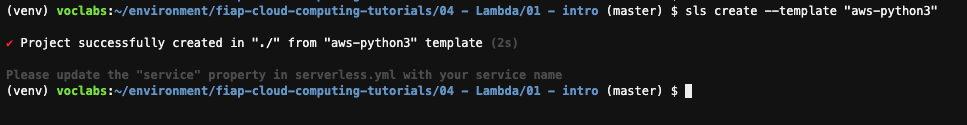
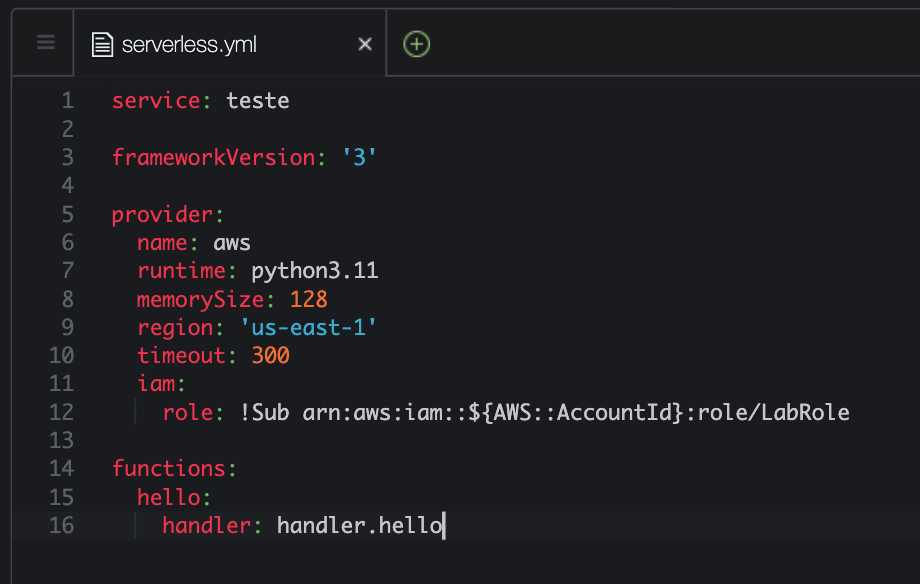
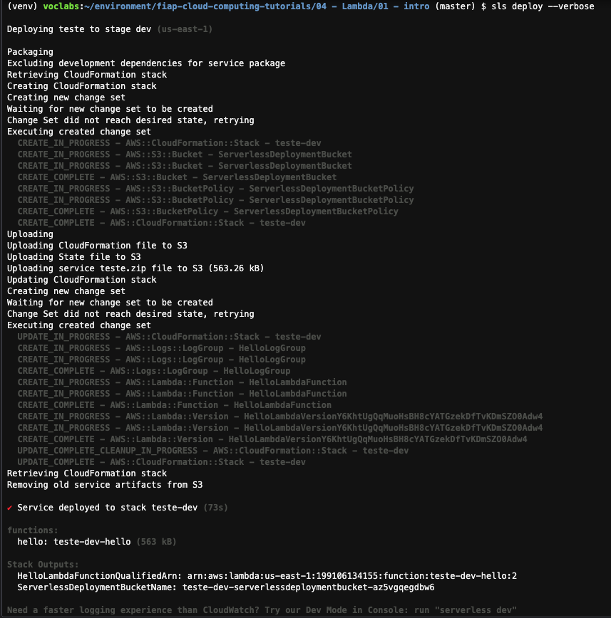
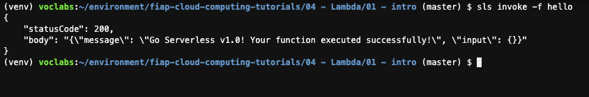
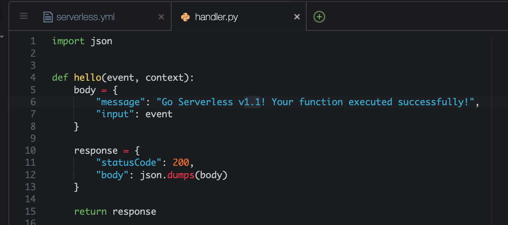
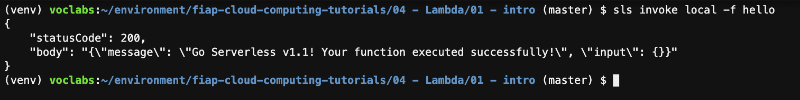
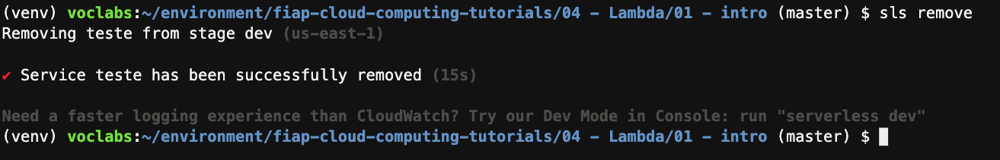

# Aula 02.1 - Lambda

**Antes de começar, execute os passos abaixo para configurar o ambiente caso não tenha feito isso ainda na aula de HOJE: [Preparando Credenciais](../../01-create-codespaces/Inicio-de-aula.md)**

1. No terminal do IDE criado no codespaces execute o comando `cd /workspaces/impacta-devops-serverless/02-Serverless/01-Lambda/01-Intro/` para entrar na pasta que fara este exercicio.
2. Iniciar o repositório de trabalho `sls create --template "aws-python3"`
 
  

3. Abra o arquivo serverless.yml no IDE com o comando `code serverless.yml`
4. Altere o arquivo para que fique como na imagem abaixo. Para salvar utilize CTRL+S.
   
   

5. No terminal do IDE faça deploy da função criada com o comando `sls deploy --verbose`. Esse comando vai mostrar cada etapa sendo feita em detalhes, bem como o status do cloudformation criado.
 
  

7. Testar remotamente a função `sls invoke -f hello`

  

8. Execute o comando `code handler.py` e altere a versão do retorno da função para 1.1 no arquivo "handler.py" como na imagem e salve com as teclas "CTRL + S"
  
9.  Faça um teste local da sua função no terminal com o comando `sls invoke local -f hello` 
  
10.    Para deletar a função que esta no lambda utilize o comando `sls remove`
  
