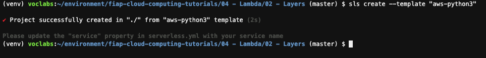
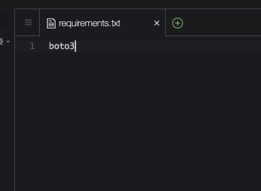
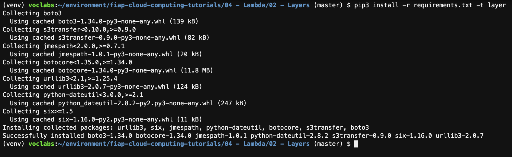
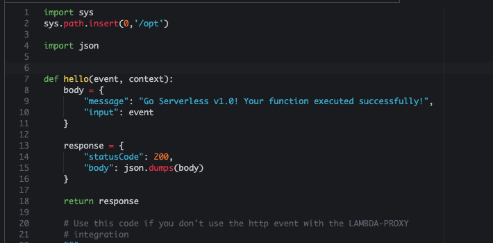
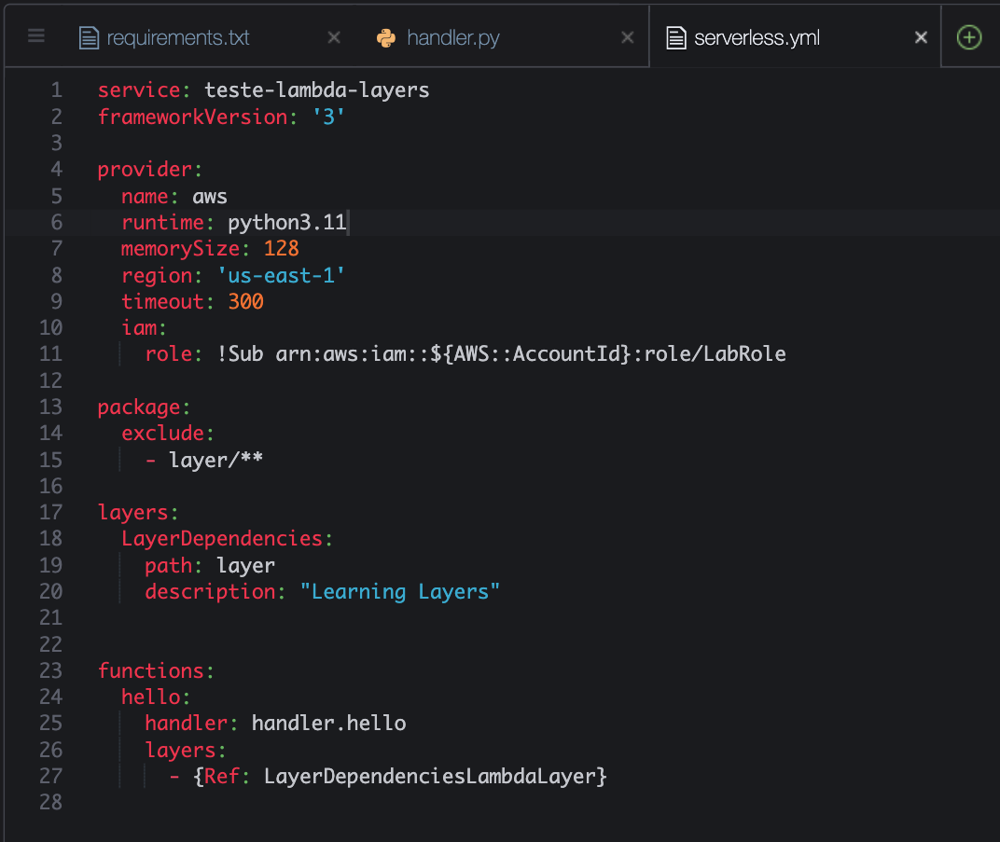
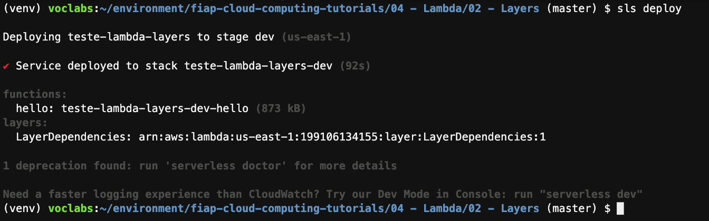
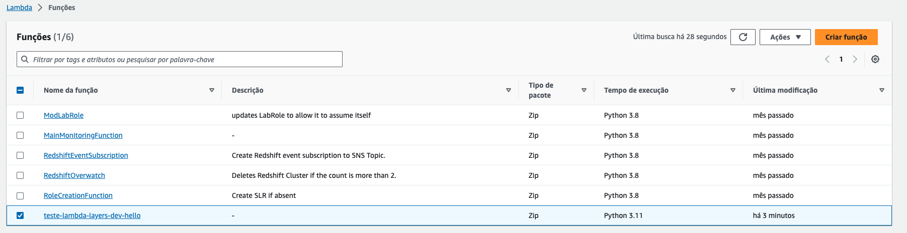
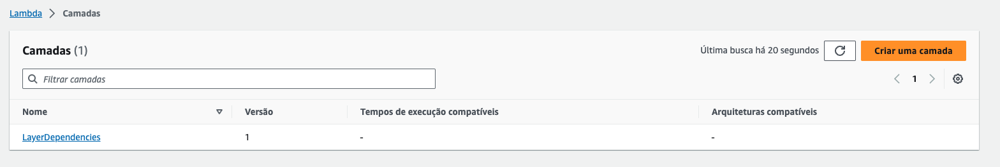
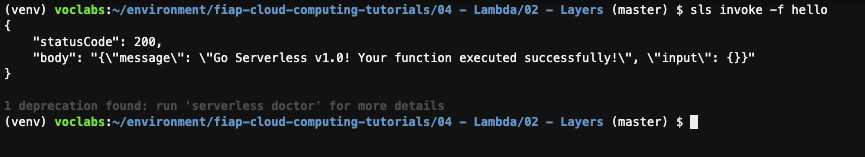

# Aula 02.2 - Lambda Layers

**Antes de começar, execute os passos abaixo para configurar o ambiente caso não tenha feito isso ainda na aula de HOJE: [Preparando Credenciais](../../01-create-codespaces/Inicio-de-aula.md)**

1. No terminal do IDE criado no codespaces execute o comando `cd ~/environment/impacta-devops-serverless/02-Serverless/01-Lambda/02-Layers/` para entrar na pasta que fara este exercicio.
   
2. Iniciar o repositório de trabalho `sls create --template "aws-python3"`.
  
    

3. Crie um arquivo chamado requirements.txt com o conteúdo 'boto3' Crie o arquivo com o comando `code requirements.txt`. Salve com CTRL+S.
       
      

4. Execute o comando no terminal `pip3 install virtualenv && python3 -m venv ~/venv` para criar um ambiente virtual python e pode baixar as dependencias sem conflitar com nenhuma dependecia já baixada.
5. Execute o comando no terminal `source ~/venv/bin/activate` para ativar o ambiente virtual criado no passo anterior
6. Crie uma pasta chamada `layer` utilizando o comando no terminal `mkdir layer`.
7. Execute o comando `pip3 install -r requirements.txt -t layer` para instalar todas as dependencias listadas no arquivo requirements.txt dentro da pasta layer.
    
    

8. Execute o comando `code handler.py` e altere o topo do arquivo handler.py para que fique como na imagem:
   
   

9.  Execute o comando `code serverless.yml`, No serverless.yml deixe o arquivo como na imagem, podem apagar todo o conteudo existente: 
   
   

10. Fazer deploy da função criada `sls deploy`
   
    

11. Em uma outra aba do seu navegavor abra o [console da AWS no serviço Lambda](https://us-east-1.console.aws.amazon.com/lambda/home?region=us-east-1#/functions).
12. Note a função que acabou de criar já esta no painel, para ver a layer clique em "camadas" no menu lateral da página
    
    

13. Para visualizar as camadas(Layers) criadas abra essa outra [janela](https://us-east-1.console.aws.amazon.com/lambda/home?region=us-east-1#/layers).
    
    

13. Para invocar remotamente a função utilize o comando `sls invoke -f hello` no terminal do codespaces.
  
  

1.  Destrua a função feita `sls remove`