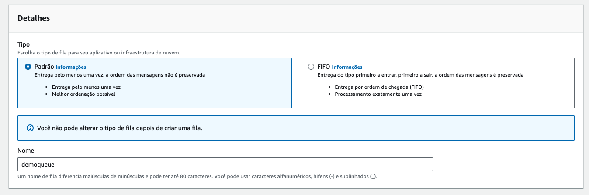
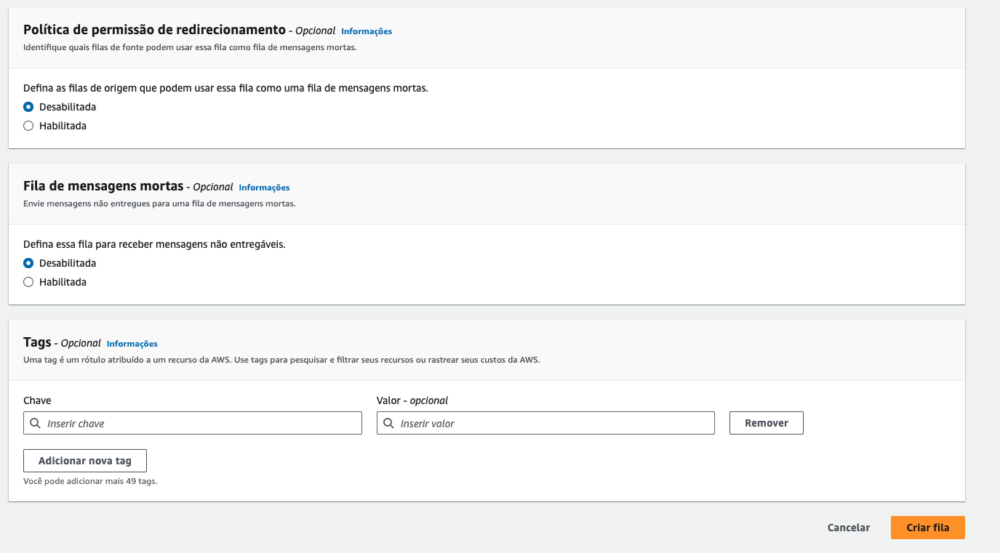
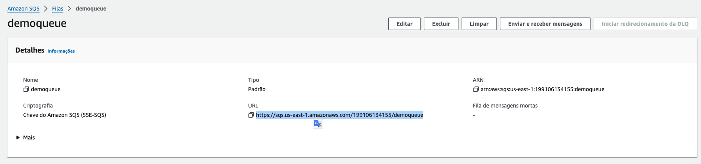
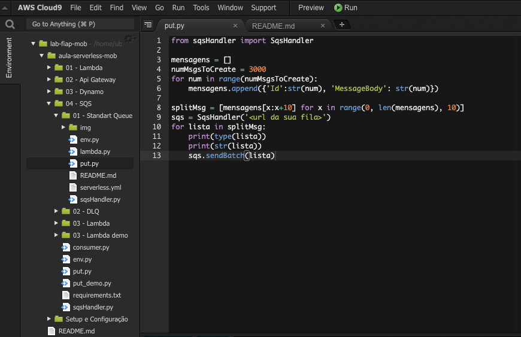
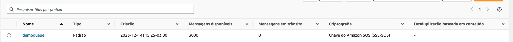
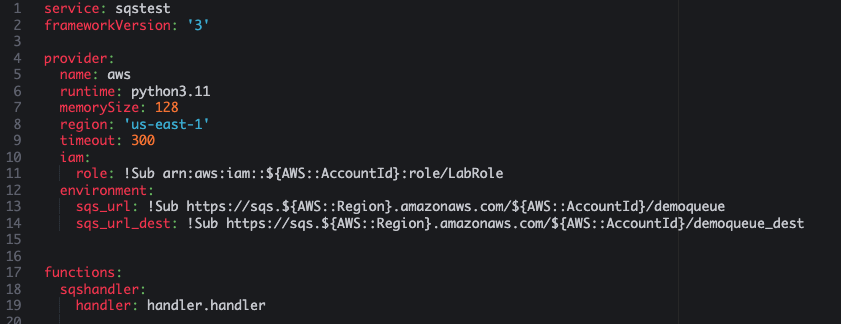
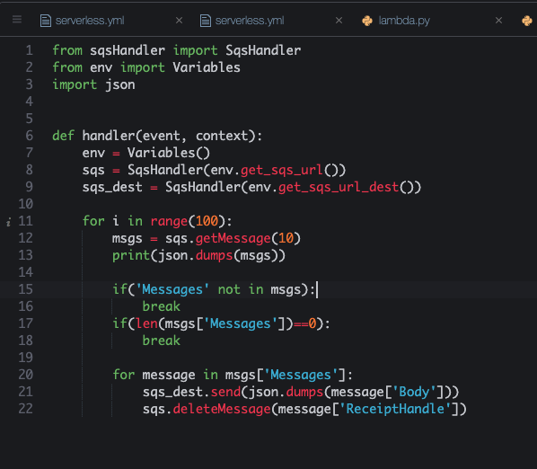
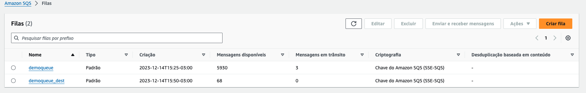

# Aula 04.1 - Standart Queue

**Antes de começar, execute os passos abaixo para configurar o ambiente caso não tenha feito isso ainda na aula de HOJE: [Preparando Credenciais](../../01-create-codespaces/Inicio-de-aula.md)**

### Criando a fila sqs

1. [Crie uma fila](https://us-east-1.console.aws.amazon.com/sqs/v3/home?region=us-east-1#/create-queue) no sqs colocando o nome 'demoqueue', deixe os valores default e clique em 'Criar Fila'
    

    

2. Copie a URL da sua fila que esta disposta conforme imagem:
    

### Enviando dados para a fila

1. No terminal do CLoud 9 IDE criado no codespaces execute o comando `cd ~/environment/impacta-devops-serverless/02-Serverless/02-SQS/01-Standard-Queue/` para entrar na pasta que fara este exercicio.
2. Abra o arquivo put.py com o comando `code put.py`
3. Altere o arquivo put.py adicionando a URL da fila do sqs que criou nos passos anteriores

    

3. Execute os comandos abaixo para garantir que esta em um ambiente virtual do python com as dependencias necessárias para executar o execício:

   ``` shell
   pip3 install virtualenv && python3 -m venv ~/venv
   source ~/venv/bin/activate
   pip3 install boto3
   ```

4. Execute o comando `python3 put.py` no terminal para colocar 3000 mensagens na fila. Verifique no [console](https://us-east-1.console.aws.amazon.com/sqs/v3/home?region=us-east-1#/queues) o resultado do comando.


### Consumindo SQS

1. [Crie mais uma fila](https://us-east-1.console.aws.amazon.com/sqs/v3/home?region=us-east-1#/create-queue) sqs utilizando o mesmo procedimento do exercicio anterior com o mesmo nome da anterior com o sulfixo '_dest', ficará `demoqueue_dest`
2. Execute o comando no terminal do cloud 9 `sls create --template "aws-python3"`
3. Abra o arquivo serverless.yml com o comando `code serverless.yml`
4. Altere o arquivo 'serverless.yml' e coloque o seguinte conteudo, não esqueça de preencher as duas URLs das filas como descrito:



5. Crie o arquivo 'handler.py' com o seguinte conteudo. O abra com o seguinte comando `code handler.py`

7. rode o comando `sls deploy`
8. Coloque alguns itens na fila com o comando `python3 put.py`, lembrando que cada execução do lambda criado pode consumir até 1000 posições da fila sqs.
9. Para execução do lambda rode o comando `sls invoke -l -f sqshandler` no terminal
10. Enquando espera o comando terminar pode observar no painel do SQS as mensagens se movendo a cada atualização manual pelo canto direito superior. Lembre que cada execução move 1000 por definição no código. [Link para painel SQS](https://console.aws.amazon.com/sqs/v2/home?region=us-east-1#/queues)
    
11. Se esperar alguns execuções vai ver que a fila principal vai zerar.
12. Execute o comando `sls remove` no terminal para remover o que foi criado.
