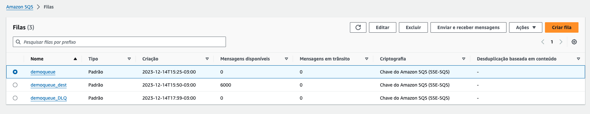
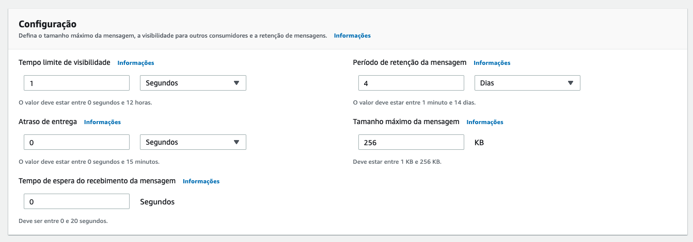
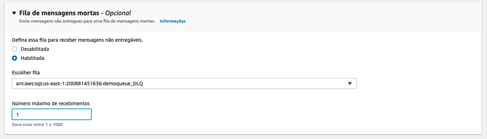
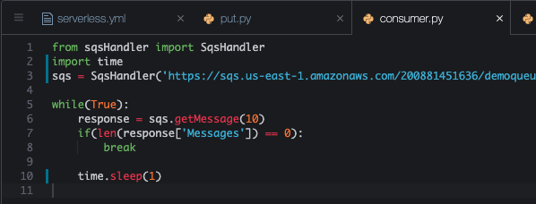
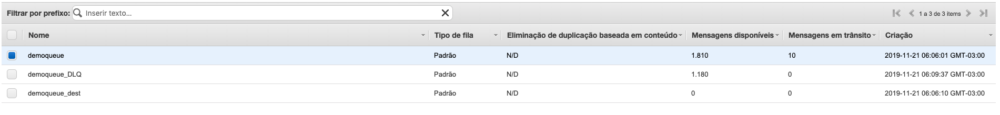

# Aula 04.2 - DLQ Queue

**Antes de começar, execute os passos abaixo para configurar o ambiente caso não tenha feito isso ainda na aula de HOJE: [Preparando Credenciais](../../01-create-codespaces/Inicio-de-aula.md)**

1. No terminal do IDE criado no codespaces execute o comando `cd /workspaces/impacta-devops-serverless/02-Serverless/02-SQS/02-DLQ/` para entrar na pasta que fara este exercicio.
2. Na [aba do SQS](https://us-east-1.console.aws.amazon.com/sqs/v3/home?region=us-east-1#/create-queue) crie uma fila com o mesmo nome de uma fila já criada e coloque o sulfixo '_DLQ', ficará `demoqueue_DLQ`. Mantenha todo o restante das informação com o que esta pré preenchido.
3. De volta ao painel de [listagem de filas do SQS](https://us-east-1.console.aws.amazon.com/sqs/v3/home?region=us-east-1#/queues), selecione a fila `Demoqueue` clique em `Editar` no canto superior direito

4. Preencha as informações como nas imagens, e clique me 'Salvar'. Na primeira você esta alterando o tempo de visibilidade para 1 segundo para que a mensagem volte para fila 1 segundo após ter sido entregue a um consumidor e não retirada da fila nesse meio tempo. A segunda configuração, você esta adicionando a demoqueue_DLQ como fila de mensagem mortas e configurando para que mensagens entregues mais de uma vez sejam enviadas a ela.


5. Altere o arquivo put.py colocando a URL da fila demoqueue nele, para abrir utilize `code put.py` no terminal do codespaces. Para pegar a URL você pode entrar no console do SQS ou através do comando `aws sqs get-queue-url --queue-name demoqueue | jq .QueueUrl`
6. Antes de qualquer execução, limpe o conteúdo de todas as filas que serão utilizadas com o comando abaixo:
``` shell
for queue_url in $(aws sqs list-queues --query 'QueueUrls[*]' --output text); do
    aws sqs purge-queue --queue-url "$queue_url"
    echo "Purged queue: $queue_url"
done
```

<blockquote>
Este comando faz o seguinte:

1. aws sqs list-queues --query 'QueueUrls[*]' --output text: Lista todas as URLs das filas do SQS.
2. for queue_url in $(...); do ... done: Itera sobre cada URL de fila.
3. aws sqs purge-queue --queue-url "$queue_url": Apaga todas as mensagens da fila específica.
4. echo "Purged queue: $queue_url": Imprime uma mensagem indicando que a fila foi purgada.
</blockquote>

7. execute o comando `python3 put.py` no terminal
8. Faça as alterações no arquivo consumer.py(`code consumer.py`)conforme a imagem a baixo, não esquecendo de colcoar sua URL da demoqueue:



9. Execute o comando `python3 consumer.py` no terminal
10. Observe que enquanto roda o script a fila DLQ é populada no console do SQS. [Link para painel SQS](https://console.aws.amazon.com/sqs/v2/home?region=us-east-1#/queues)
    